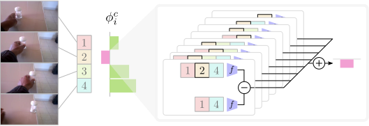

# Play Fair: Frame Attributions in Video Models



[Website](https://play-fair.willprice.dev/) | 
[Demo](http://play-fair.uksouth.cloudapp.azure.com/?uid=53611&n-frames=10) | 
[arXiv](https://arxiv.org/abs/2011.12372)

This repository contains the code accompanying the ACCV 2020 paper "Play Fair: Frame Attributions in Video Models". 
We introduce a way of computing how much each frame contributes to the output of a model.
Our approach, the Element Shapley Value (ESV), is based on the classic solution to the reward distribution
problem in cooperative games called the Shapley Value.
ESV is not just restricted to evaluating the contribution of a frame to a video,
but can be applied to any model that performs light-weight modelling on top of time
series data to assess the contribution of each element in the series.

**Want to play around with Element Shapley Values for the models in the paper?**

Check out our [demo](http://play-fair.uksouth.cloudapp.azure.com/?uid=53611&n-frames=10)
which allows you to investigate the ESVs computed for a TRN model on the Something
-Something v2 dataset.

If you want to explore further follow the set up guide below, extract features from the 
backbone models, and compute ESVs yourself.

<!--
**Looking to compute Element Shapley Values for your model?**

Read through the sections on how to add new datasets and models.
-->


# Set up
## Environment

```bash
$ conda env create -n play-fair -f environment.yaml
```

You will also need to install a version of ffmpeg with vp9 support, we suggest using the
static builds provided by John Van Sickle: 

```bash
$ wget "https://johnvansickle.com/ffmpeg/builds/ffmpeg-git-amd64-static.tar.xz"
$ tar -xvf "ffmpeg-git-amd64-static.tar.xz"
$ mkdir -p bin
$ mv ffmpeg-git-*-amd64-static/{ffmpeg,ffprobe} bin
```

You will always need to set your PYTHONPATH to include the `src` folder. We provide a
`.envrc` for use with [`direnv`](https://direnv.net/) which will automatically do that 
for you when you cd in the project directory. Alternatively just run:
  
```bash
$ export PYTHONPATH=$PWD/src 
```

## Data

We store our files in the [`gulpio`](https://github.com/TwentyBN/GulpIO) format.

1. Download [something-something-v2](https://20bn.com/datasets/something-something)
2. Gulp the validation set
   ```bash
   $ python src/scripts/gulp_ssv2.py \
        <path-to-labels>/something-something-v2-validation.json \
        <-path-to-20bn-something-something-v2> \
        datasets/ssv2/gulp/validation
   ```
   This should take around ~15 mins if you are writing to an SSD backed filesystem,
   it will take longer if you're writing to an HDD. If you need to write the gulp
   directory to somewhere other than the path specified in the command above, make
   sure to symlink it afterwards to `datasets/ssv2/gulp/validation` so the
   configuration files don't need to be updated.
   
## Models

We provide two models, a TRN and TSN, for analysis. Download these by running

```bash
$ cd checkpoints
$ bash ./download.sh
```

Check that they have all downloaded:
```bash
$ tree -h
.
├── [4.0K]  backbones
│   ├── [ 40M]  trn.pth
│   └── [ 92M]  tsn.pth
├── [2.5K]  download.sh
└── [4.0K]  features
    ├── [ 37M]  mtrn_16_frames.pth
    ├── [ 10M]  mtrn_8_frames.pth
    ├── [8.0M]  trn_10_frames.pth
    ├── [8.8M]  trn_11_frames.pth
    ├── [9.5M]  trn_12_frames.pth
    ├── [ 10M]  trn_13_frames.pth
    ├── [ 11M]  trn_14_frames.pth
    ├── [ 12M]  trn_15_frames.pth
    ├── [ 13M]  trn_16_frames.pth
    ├── [1.3M]  trn_1_frames.pth
    ├── [2.0M]  trn_2_frames.pth
    ├── [2.8M]  trn_3_frames.pth
    ├── [3.5M]  trn_4_frames.pth
    ├── [4.3M]  trn_5_frames.pth
    ├── [5.0M]  trn_6_frames.pth
    ├── [5.8M]  trn_7_frames.pth
    ├── [6.5M]  trn_8_frames.pth
    ├── [7.3M]  trn_9_frames.pth
    └── [175K]  tsn.pth

2 directories, 22 files
```

# Extracting features

As computing ESVs is expensive, requiring many thousands of model evaluations, we work
with temporal models that operate over features. We can run these in a reasonable
amount of time, in the order of milliseconds--seconds depending on number of frames and
whether approximate methods are used or not.

We provide a script to extract per-frame features, saving them to an HDF file.
Extract these features for TSN and TRN

```bash
$ python src/scripts/extract_features.py \
    --split validation \
    configs/trn_bninception.jsonnet \
    dataset/ssv2/features/trn.hdf

$ python src/scripts/extract_features.py \
    --split validation \
    configs/tsn_resnet50.jsonnet \
    dataset/ssv2/features/tsn.hdf
```

# Computing ESVs

We provide two methods to compute ESVs, one where the model supports a variable-length 
input (e.g. TSN) and one which takes a collection of models each of which operate over 
a fixed-length input (e.g. TRN).

## Computing class priors

Regardless of whether your model supports variable-length inputs or not, we need to
compute the class priors to use in the computation of the ESV. We provide a script that
does this by computing the empirical class frequency over the training set.

```bash
$ python src/scripts/compute_ssv2_class_priors.py \
    something-something-v2-train.json \
    datasets/ssv2/class-priors.csv
```

## Models supporting a variable-length input

Computing ESVs for models' supporting variable-length input is a straight forward
application of the original Shapley Value formula using the characteristic function:

v(X) = f(X) - f(∅)

We have to define f(∅), the simplest choice is to define it as the the prior
probability of observing a class based on the frequency of examples in the training
set. Alternatively you can run the model over the training set to obtain the average
output (practically there is little difference between these choices).

Since the Shapley value is computed by measuring the difference between characteristic
function evaluations, we make an optimisation by eliminating the subtraction of *f(∅)* in
the implementation. Instead we tweak the definition of the
characteristic function to be v(X) = f(X) if |X| >= 1, else we define v(∅) as the 
set of class priors. This results in computing the same Shapley
values but without having to perform a subtraction for each characteristic function
evaluation. We implement this in the 
[`CharacteristicFunctionShapleyAttributor`](src/attribution/characteristic_function_shapley_value_attributor.py).

We provide an example of how to do this for TSN as it is a model supporting a
variable-length input:
(make sure you're set up your environment, downloaded and prepped the dataset,
and downloaded the models first)

```bash
$ python src/scripts/compute_esvs.py \
    configs/feature_tsn.jsonnet \
    datasets/ssv2/class-priors.csv \
    tsn-esv-n_frames=8.pkl \
    --sample-n-frames 8
```


## Models supporting a fixed-length input

For models that don't support a variable-length input, we propose a way of ensembling
a collection of fixed-length input models into a new meta-model which we can then
compute ESVs for.
To make this explanation more concrete, we now describe the process in detail for TRN.
To start with, we train multiple TRN models for 1, 2, ..., n frames separately. 
By training these models separately we ensure that they are capable of acting alone
(this also has the nice benefit of improving performance over joint training in our
experience!).
At inference time, we compute all possible subsampled variants of the input
video we wish to classify and pass each of these through the corresponding single scale
model. We aggregate scores so that each scale is given equal weighting in the final
result.

Our paper proposes a joint computation method of this multiscale model and its ESVs.
This is implemented in the 
[`OnlineShapleyAttributor`](src/attribution/online_shapley_value_attributor.py) class.

We provide an example of how to do this for TRN, as the basic variant only supports a
fixed-length input.
(make sure you're set up your environment, downloaded and prepped the dataset, and 
downloaded the models first)

```bash
$ python src/scripts/compute_esvs.py \
    configs/feature_multiscale_trn.jsonnet \
    datasets/ssv2/class-priors.csv \
    mtrn-esv-n_frames=8.pkl \
    --sample-n-frames 8
```

## Visualisation

We provide a dashboard to investigate model behaviour when we vary how many frames are 
fed to the model. This dashboard is powered by multiple sets of results produced by
the `compute_esv.py` script.

First we compute ESVs for 1--8 frame inputs:
```bash
$ for n in $(seq 1 8); do
    python src/scripts/compute_esvs.py \
        configs/feature_multiscale_trn.jsonnet \
        datasets/ssv2/class-priors.csv \
        mtrn-esv-n_frames=$n.pkl \
        --sample-n-frames $n
  done
```
Then we collate them:

```bash
$ python src/scripts/collate_esvs.py \
    --dataset "Something Something v2" \
    --model "MTRN" \
    mtrn-esv-n_frames={1..8}.pkl \
    mtrn-esv-min_n_frames=1-max_n_frames=8.pkl
```

before we can run the dashboard, we need to dump out the videos from he gulp directory
as webm files (since when we gulp the files, the FPS is altered!).
Watch out that you don't end up using the conda bundled ffmpeg which doesn't support
VP9 encoding if you replace `./bin/ffmpeg` with `ffmpeg`, check which you are using
by running `which ffmpeg`.

```bash
$ python src/scripts/dump_frames_from_gulp_dir.py \
    datasets/ssv2/gulp/validation
    datasets/ssv2/frames

$ for frame_dir in datasets/ssv2/frames/*; do \
    if [[ -f "$frame_dir/frame_000001.jpg" && ! -f "${frame_dir}.webm" ]] ; then \
      ./bin/ffmpeg \
          -r 8 \
          -i "$frame_dir/frame_%06d.jpg" \
          -c:v vp9 \
          -row-mt 1 \
          -speed 4 \
          -threads 8 \
          -b:v 200k \
          "${frame_dir}.webm"; \
    fi \
 done
$ mkdir datasets/ssv2/videos
$ mv datasets/ssv2/frames/*.webm datasets/ssv2/videos
```

and now we can run the ESV dashboard:

```bash
$ python src/apps/esv_dashboard/visualise_esvs.py \
    mtrn-esv-min_n_frames=1-max_n_frames=8.pkl \
    datasets/ssv2/videos \
    src/datasets/metadata/something_something_v2/classes.csv
```

## Approximating ESVs

When sequences become long, it no longer becomes possible to compute ESVs exactly and
instead an approximation has to be employed. `compute_esvs.py` supports computing
approximate ESVs through the `--approximate*` flags. Also check out the
[approximation demo notebook](notebooks/approximating-esvs.ipynb) to see how changing
the approximation parameters effects the variance of the resulting ESVs.

<!--
# Adding new datasets and models 

To add a new dataset or model, you need to understand the architecture of the
codebase. It is largely configuration driven. The concrete definitions of
configurations live in `configs` (e.g. `configs/trn_resnet50.json`), this is loaded
by the code using `load_jsonnet` and instantiates a `RGBConfig` object. This
contains all the information needed to instantiate the dataset and model. Adding
support for a new model or dataset involves adding new configuration types, writing
the necessary code for creating the model/data, and writing wiring code. We'll step
through how to do that for adding a new model or dataset.

## Dataset

Let's say you want to evaluate some trained models on 20BN's Jester dataset. The
first thing we need to do is write a `Dataset` class (different from the one in 
`torch.utils.data`) that encapsulates how many classes the dataset has, how to
construct the train and validation sets, and how to map from class ids to human
readable names.

Add a new file to `src/datasets/jester.py` and define a new class inheriting from
[`Dataset`](src/datasets/base.py)

## Model
-->


